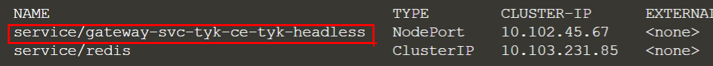
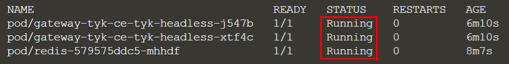

So far, so good. Now let's get our Tyk API Gateway deployed.

*  Install the community edition Tyk Gateway using the open source Helm chart
`helm install tyk-ce tyk-helm/tyk-headless -n tyk`{{execute}}
	
*  Review the output until it's up-and-running. You can use Ctrl+C to stop listening and get back to the main terminal
`watch kubectl get all -n tyk`{{execute}}
	
What you should see is the gateway service has been created:

And the pods are initialized and in the "Running" status:

Congratulations, your Tyk Gateway is now configured and running!
